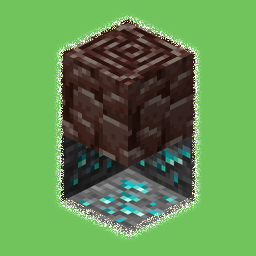
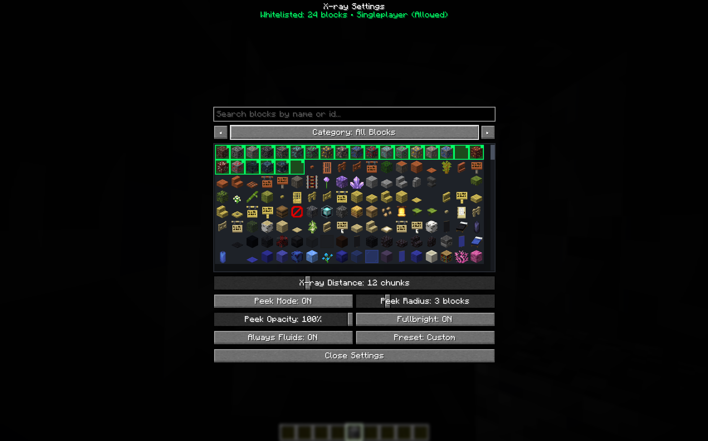
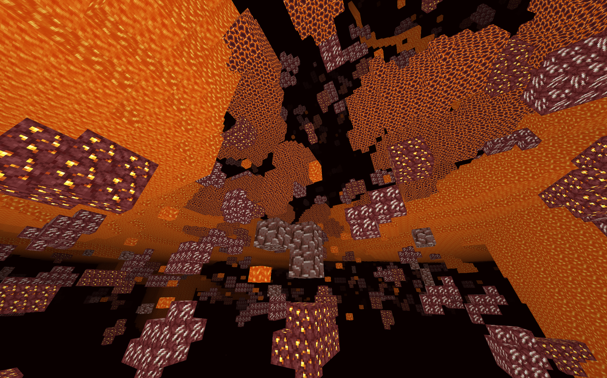

<div align="center">
  
  <h1>X-Ray Mod</h1>

  [](https://github.com/trouvaiilx/xray-mod/actions/workflows/build.yml)
  [](https://opensource.org/licenses/MIT)
  [](https://ko-fi.com/trouvaiilx)

  <p>Client-side Fabric mod for <b>Minecraft 26.2</b> by <b><a href="https://github.com/trouvaiilx">trouvaiilx</a></b>: toggleable X-ray featuring customizable block peek mode, chest/container entity culling, fullbright, in-game GUI, and Sodium (<code>mc26.2-0.9.1-fabric</code>) rendering hooks.</p>
</div>

> **Sodium Required**: This mod **ONLY works when the [Sodium](https://modrinth.com/mod/sodium) mod is installed**. Sodium provides the chunk rendering pipeline that this mod hooks into to hide non-whitelisted blocks and apply fullbright lighting. Without Sodium installed, X-ray rendering will **NOT** function (attempting to use commands or keybinds will display a warning message in chat).

> **Modrinth Content Rules Compliant**: In accordance with [Modrinth Rule 3.3.a](https://modrinth.com/legal/rules), X-ray functionality strictly requires a **server-side opt-in** in multiplayer environments:
> - **Singleplayer / Integrated Local Game**: Fully unlocked by default (you are the local host).
> - **Multiplayer Dedicated Servers**: X-ray features are disabled by default unless the server explicitly opts in by installing this mod on the server or broadcasting the `xray-mod:opt_in` handshake packet.
>
> 💡 *Looking for a standalone version without server opt-in checks (e.g. for personal use or private servers)? Check out the [`client-only`](https://github.com/trouvaiilx/xray-mod/tree/client-only) branch.*

> **Why This Mod Was Created**: After searching everywhere for a modern Fabric X-ray mod, none were available that natively supported Sodium's custom rendering pipeline without issues. This mod was built from the ground up to solve that, hooking directly into Sodium for smooth, glitch-free X-ray rendering!

---

## Server Opt-In & Multiplayer Setup

To allow players to use X-Ray on your dedicated server:
1. Install this mod JAR into your server's `mods/` directory.
2. Server configuration is stored at `config/xray-mod-server.json`:
   ```json
   {
     "allowXray": true
   }
   ```
3. Admins (level 2+) can also toggle X-ray permissions dynamically in-game or from console:
   - `/xrayserver status` — View current opt-in status.
   - `/xrayserver allow <true|false>` — Update opt-in permission and immediately broadcast the update to all connected players.

> **Note**: If you want a purely client-side build without any server-side companion mod or opt-in requirements, switch to the [`client-only`](https://github.com/trouvaiilx/xray-mod/tree/client-only) branch.

## Features

- **Customizable Peek Mode**:
  - Outlines local unmined boundary blocks, non-full blocks (slabs, stairs, fences), and container entities (*Chest Boats*, *Minecarts with Chests*, *Chest Rafts*, *Hoppers*, *Spawners*) with customizable wireframe bounding boxes.
  - Enabled by default with a soft cyan (`#00E5FF`) stroke color.
  - Configurable **Peek Radius** (1–10 blocks) and **Peek Opacity** (1%–100%) via GUI sliders or `/xray peek` commands.
- **Chest & Container Entity Integration**:
  - Dynamically intercepts `BlockEntityRenderDispatcher` and `EntityRenderDispatcher`.
  - Non-whitelisted chests, trapped chests, vaults, shulker boxes, barrels, chest minecarts, and chest boats are **culled and hidden** through walls when X-ray is enabled.
  - Whitelisted chests and container entities receive **Fullbright** lightmap coordinates when Fullbright is active.
- **In-Game Settings GUI**: Press **Right Shift** (or configure in Options > Controls) to open the interactive settings menu.
  - Features real-time vertical scrollbar dragging, emerald cell whitelist highlights (`#00FF66`), active whitelisted block counter badge, and pre-cached icon rendering for zero-lag scrolling.
- **Keybind Shortcuts**:
  - **Backslash (`\`)**: Toggle X-Ray ON / OFF (triggers immediate live chunk re-render).
  - **Apostrophe (`'`)**: Toggle Peek Mode ON / OFF.
  - **Right Shift**: Open Settings GUI.
- **Commands**: `/xray`, `/xray toggle`, `/xray peek [on|off]`, `/xray peek radius <1-10>`, `/xray peek opacity <1-100>` with full tab-completion.
- **Search & Category Filters**: Easily filter blocks by category (*All*, *Ores*, *Storage*, *Redstone*, *Structures*, *Nether*, *End*, *Underground*, *Natural*, *Building*, *Other*) or search by block ID and localized name.
- **Preset System**: Quick-select presets (*Default*, *Ores*, *Fluids*, *Valuables*, or *Custom*).
- **X-Ray Render Distance**:
  - **Non-whitelisted blocks** (stone, dirt, etc.) are always rendered as transparent (hidden) across the entire view distance.
  - **Whitelisted blocks** (ores, chests, fluids) render only within the configured X-ray render distance (2–32 chunks).
- **Fullbright Lighting**: Forces fullbright lightmap values and disables ambient occlusion shading for whitelisted blocks, block entities, container entities, and fluids.
- **Always Fluids Safety Toggle**: A dedicated toggle (`Always Fluids: ON/OFF`) locking water and lava as whitelisted to prevent accidental removal.
- **Persistence**: Auto-saves configuration to `config/xray-mod.json` with write-then-atomic-rename safety.

---

## Screenshots

<div align="center">
  <h3>In-Game Configuration Menu</h3>
  

  <br/><br/>

  <table>
    <tr>
      <td align="center" width="50%">
        <b>Overworld X-Ray & Peek Mode</b><br/>
        
      </td>
      <td align="center" width="50%">
        <b>Nether X-Ray</b><br/>
        
      </td>
    </tr>
  </table>
</div>

---

## Controls & Commands

| Feature | Input / Command | Description |
| --- | --- | --- |
| **Toggle X-Ray** | `\` or `/xray` / `/xray toggle` | Toggles X-ray on/off with immediate live chunk re-render |
| **Toggle Peek Mode** | `'` or `/xray peek [on/off]` | Toggles wireframe boundary outlines for blocks and container entities |
| **Open Menu** | **Right Shift** | Opens the interactive settings GUI menu |
| **Set Peek Radius** | `/xray peek radius <1-10>` | Adjusts Peek Mode outline radius (1 to 10 blocks) |
| **Set Peek Opacity** | `/xray peek opacity <1-100>` | Adjusts Peek Mode line opacity percentage (1% to 100%) |
| **Server Status** | `/xrayserver status` | (Server/Admin) View current server opt-in status |
| **Server Opt-In** | `/xrayserver allow <true/false>` | (Server/Admin) Toggle server-wide X-ray permission |

---

## Requirements

- **Sodium**: `mc26.2-0.9.1-fabric` (**STRICTLY REQUIRED** — X-ray rendering only works when Sodium is installed!)
- **Minecraft**: 26.2
- **Fabric Loader**: 0.19.3+
- **Java JDK**: 25 (Required for Minecraft 26.1+)

---

## Building & Updating

Ensure `JAVA_HOME` is pointed to a JDK 25 installation:

```bash
./gradlew build
```

The compiled mod JAR will be output to `build/libs/xray-mod-<version>+<mc_version>.jar`.

For detailed guidelines on updating the mod for new Minecraft/Sodium versions or contributing changes, see:
- [Updating Guide](docs/UPDATING.md)
- [Contributing Guidelines](CONTRIBUTING.md)

---

## Support

If you enjoy using this mod and would like to support its ongoing development, consider buying me a coffee!

[](https://ko-fi.com/trouvaiilx)

---

## License

This project is licensed under the MIT License - see the [LICENSE](LICENSE) file for details.
